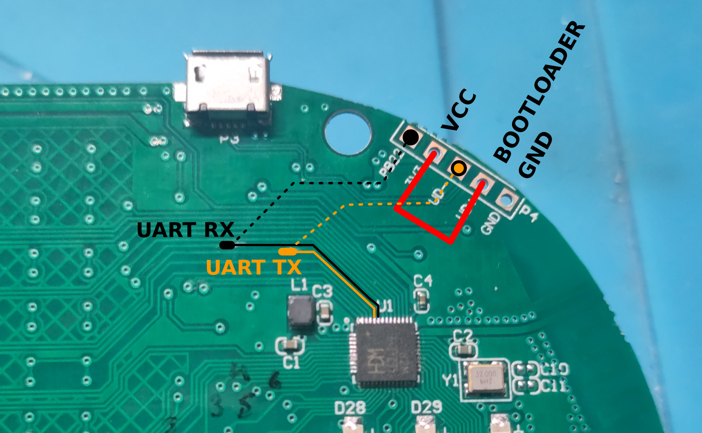

# A8 Mini 2.4 GHz keyboard firmware for Virtu's DIY Meshtastic Pager

This opensource firmware for the A8 mini 2.4 GHz keyboard from AliExpress
is provided as-is with absolutely no warranty, use it at your own risk.

## Requirements

This project must be compile with [Moun River Studio 2 IDE](https://www.mounriver.com/download). A precompiled HEX file is provided in this repository for those who don't want
to install this IDE.

[Wchisp](https://github.com/ch32-rs/wchisp) is used to flash this firmware file on the target chip, following the flashing
procedure detailed below.

## Build from source

- Open the `CH582M.wvproj` file with Moun River Studio 2
- In the _Project_ menu entry, click _Build_
- Output _HEX_ file is located in the _obj_ folder

## Preparing the keyboard PCB

The keyboard PCB has an expansion port composed of a 5-pin connector located at top right hand corner
of the circuit board with pins labeled _PB22_, _3V3_, _UD-_, _UD+_, _GND_.

## Flashing firmware

The following steps are required to flash this firmware into the CH582M SoC:

1. Disconnect the PCB USB connector from any host
2. Make sure the keyboard PCB ON/OFF switch is set to ON
3. Connect the D+ pin to 3V3 with a jumper wire
4. In a dedicated shell, prepare the following command (but DO NOT PRESS ENTER): `wchisp flash CH582M.hex`
5. Plug the USB cable in the keyboard's USB port and then to the computer
6. Disconnect the D+ pin from 3V3 and as fast as possible hit the ENTER key to run the command prepared at step 4
7. The target CH582M should be detected and programmed

## UART communication protocol

### HID reports

Every time a key is pressed or released, the firmware will send a key scan report
over the UART link. A report consist in 5 bytes describing the event:

| Offset  | Value      | Description       |
|---------|------------|-------------------|
| 0x00    | 0xA5       | Report magic      |
| 0x01    | Bitmap     | Modifiers         |
| 0x02    | scan code  | First key pressed |
| 0x03    | scan code  | Second key pressed|
| 0x04    | scan code  | Third key pressed |

The modifiers bits are defined as follows:

| Bit     | Modifier   |
|---------|------------|
| 0       | Control    |
| 1       | Shift      |
| 2       | Left Alt   |
| 3       | Right Alt  |
| 4       | Meta (Win) |

### LED control

The LEDs of the keyboard can be controlled by the host through a specific
UART message structured as follows:

| Offset  | Value      | Description      |
|---------|------------|------------------|
| 0       | 0xA6       | LED magic        |
| 1       | Bitmap     | Status LEDs      |
| 2       | 0x00-0x64  | Red LED value    |
| 3       | 0x00-0x64  | Green LED value  |
| 4       | 0x00-0x64  | Blue LED value   |

Bit 0 of the status LED field drives the wirless LED while bit 1 drives
the charge LED. Red, green and blue LEDs are RGB LEDs driven as PWM by
the firmware and used as backlight for the whole keyboard.

### Ping/pong

In order for the host to check the keyboard is correctly connected and
working, a ping/pong mechanism is available. The host sends a sequence
composed of a byte set to 0xA7 followed by 4 null bytes, and the keyboard
is expected to answer with the same sequence. If not, there is a hardware
issue or the firmware is not running as expected. 

## HID Layout

The following image shows the key layout with the corresponding HID scan codes,
based on the QWERTY variant. The `FN` key is not considered as a normal key and
has no scan code available, it is used to access the alternative keys with scan
codes in blue. Purple keys are notified through the modifiers' bits, the corresponding
bit being set to 1 when the key is pressed and 0 when it is released.
